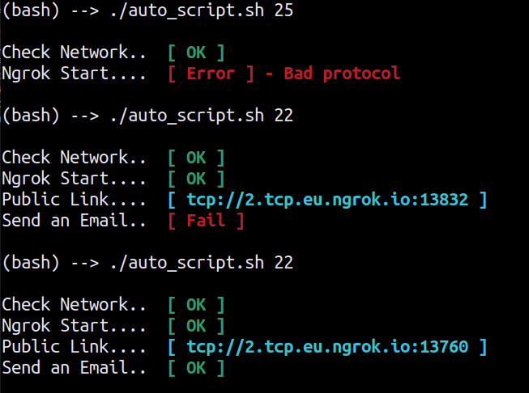

# Auto Ngrok Notification 

This repo contains script(s) to send (auto) email notification for ngrok tunnel <br/>

[](https://t.me/Le_Sudo)
[]()
[](https://python.org)

output <br/>


## Pre-requise

<li>Use <b>GNU/Linux</b> Operating System (Debian Distrib such as Ubuntu)</li>

<li>Install yagmail python module. <a href='https://mailtrap.io/blog/yagmail-tutorial/'>Click Here </a>For more information</li>

```
pip install yagmail
```

<li>Define your own directory path in <b>auto_script.sh</b> (ligne2)</li>

```
path='$HOME/Your/Directory/path'
```
<li>Configure your Gmail send account to use <b>OAUTH_2</b> </li>

## How to use ?

<li>For automation (Launch when Starting Up your PC) paste this ligne in your <b>crontab</b></li>

```
@reboot /Your/script/path/auto_script.sh 2> /Your/log/path/cron_error.log
```
<li>For simple usage juste run</li>

```
./auto_script.sh
```
